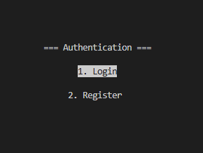
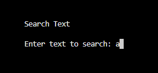
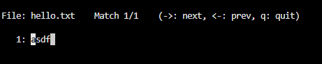
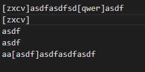
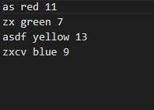

    
    <h3>공용 문서 편집기</h3>
    
by team Lidoc

## 📜 공용 문서 편집기란?

멀티 스레드와 소켓을 이용하여 동시에 문서에 접근하여 작성을 할 수 있게 해줍니다. 
단, 누군가가 작성 중일때는 작성 할 수 없으며 작성자가 펜을 놓아야 가능합니다.  

- 전체 코드 라인 수(C언어): 1714라인(주석 제외, 2025-12-7 기준)

## 👥 팀원
|  |  |
| :--------------------------------------------------------------------------------------: | :------------------------------------------------------------------------------------: | 
|                        **[홍지환](https://github.com/jihwa0603)**                        |                       **[이제민](https://github.com/hellowo1)**                        |
|                   **22 심컴**                                                            |                        **22 심컴**                                                     |
|서버 및 다중이용자  사용 문서 처리 담당 총괄PM                                                |     로그인 및 문서 기능 구현                                                             |

 

## 🕹️ 주요 기능
 - <a href="#login">로그인 시스템</a>
 - <a href="#search">단어 검색 기능</a>
 - <a href="#together">문서 공동 작업</a>
 - <a href="#save">주기적 자동 저장</a>
 - <a href="#count">기여도 측정 시스템</a>
 
 

#
- 로그인 시스템

로그인 기능이 있으며 회원가입 유저의 경우 방장의 폴더에 파일로 저장됩니다.  
물론, 비밀번호의 경우 해쉬를 이용하여 암호화 되어 있기에 다른 유저의 비밀번호를 알 수 없습니다. 
처음 등록을 할 때 아이디가 겹칠 경우 등록을 할 수 없습니다. (추가로 처음 방장이 문서를 열고 후에 다른 유저가 접속할 때 서버와 문서명을 똑같이 입력해야 합니다.)

 

# 

- 단어검색기능

문서 내부에서 읽기 상태에서 f키를 눌러 단어를 검색하고 문장을 찾아 줍니다.

 

#

- 문서 공동 작업 

처음 문서에 작성을 할 경우 먼저 색을 선택을 하고 작성을 합니다.  
이미지처럼 사용자 별로 색을 구분하여 문서를 작성합니다.

 

#

- 주기적 저장

누군가가 작성 상태에서 작성을 하고 읽기 모드로 전환을 할 때마다 문서를 저장합니다.  
폴더 2개를 사용하여 1곳에는 작성자와 문서 내용을, 1곳에는 문서 내용만을 저장합니다.

 

#

- 기여도 측정 시스템

폴더 "user_data"의 내부에 로그인 파일과 유저별 색상 및 작성 글자 수를 측정하여 저장합니다.

